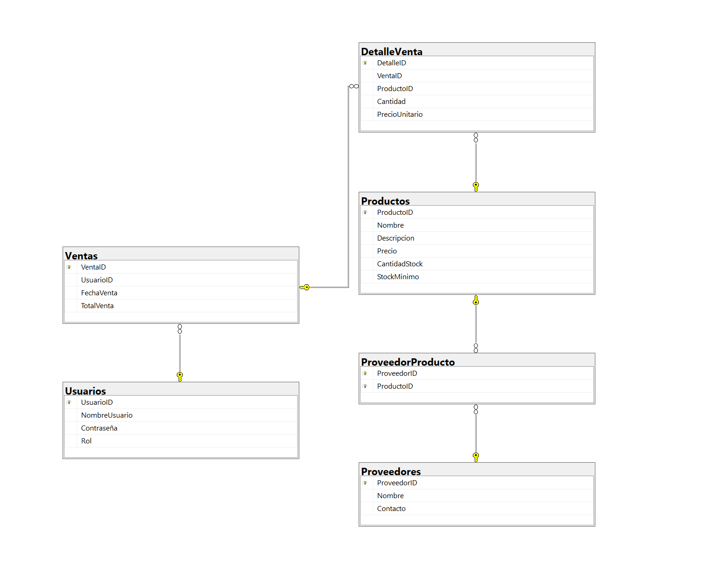
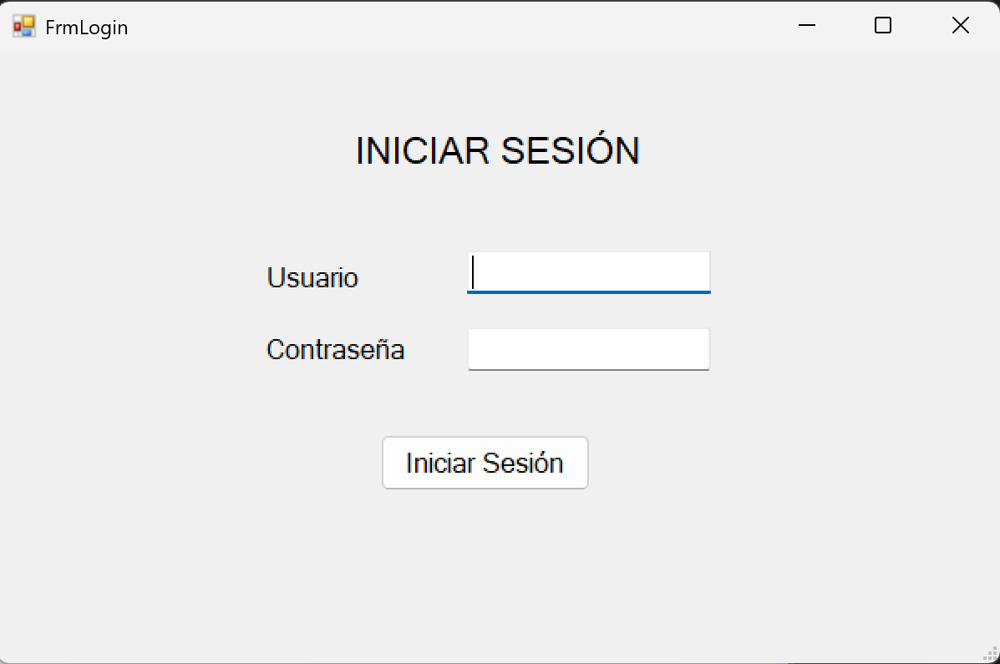
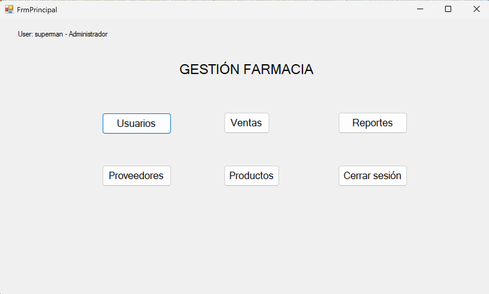

# 🎯 Sistema de Gestión para Farmacia

## 📌 Propósito del Proyecto

Este proyecto es una aplicación de escritorio desarrollada en **C# con Windows Forms** para la gestión de usuarios, productos, ventas y proveedores en una farmacia. Está orientada a mejorar el control del inventario y la trazabilidad de las ventas.

---

## 🧩 Funcionalidades Principales 

- Gestión de usuarios por roles (Administrador, Vendedor, Almacenero).
- Control de inventario (stock mínimo, promociones, entradas/salidas).
- Módulo de ventas con generación de facturas e impuestos.
- Registro y gestión de proveedores y productos suministrados.
- Reportes de ventas por fecha y producto.
- Autenticación de usuario y control de acceso.

---

## 🗃 Diagrama Entidad-Relación

  
*(Puedes subir tu diagrama como imagen a una carpeta `/docs` del repositorio)*

---

## ⚙️ Tecnologías Utilizadas

- Lenguaje: **C#**
- Interfaz gráfica: **Windows Forms**
- Base de datos: **SQL Server**
- ORM: ADO.NET (sin frameworks externos)
- Patrón de diseño: **Repository, Singleton, Unit of Work**
- Principios: **SOLID**
- Control de versiones: **Git + GitHub**

---

## 🖼️ Capturas de Pantalla

| Pantalla Principal | Formulario de Usuarios |
|--------------------|------------------------|
|  |  |

---

## 🚀 Cómo compilar y ejecutar

### Requisitos previos:
- Visual Studio 2022+
- SQL Server Express o Developer
- Base de datos creada con el script `FarmaciaBD.sql`

### Pasos:
1. Clona el repositorio:  git clone https://github.com/ejarama/GestionFarmacia.git
2. Clona el repositorio:
3. Configura la cadena de conexión en App.config: **Ten en cuenta que debes cambiar el valor de Source de acuerdo al nombre de tu servidor local**
    <connectionStrings>
		<add name="ConexionBD"
			 connectionString="Data Source=desktop-nbmes14\ejaramillo;Initial Catalog=FarmaciaDB;User ID=usr_far;Password=Segura123!;"
			 providerName="System.Data.SqlClient" />
	</connectionStrings>
4. Ejecuta el script SQL FarmaciaBD.sql en SQL Server.
5. Ejecuta la aplicación presionando F5.
6. Logeo inicial se realiza con usuario Administrador:
    usuario: superman
    contraseña: 123456

